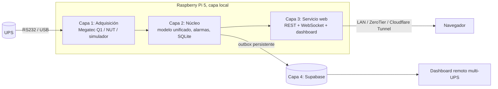

# IIT UPS Monitor

Monitoreo web de UPS con **Raspberry Pi 5** leyendo el puerto **RS232** o **USB** de la UPS.
Dashboards en vivo de voltajes, corrientes, frecuencias, potencias, batería, temperatura, estados,
alarmas y **todas las variables que entrega el puerto**. Arquitectura por capas, todo web.

Infraestructura-IT, Bogotá.

## Arquitectura por capas



| Capa | Dónde | Carpeta | Qué hace |
|---|---|---|---|
| 1 Adquisición | Raspberry | `edge/src/drivers` | Habla el protocolo de la UPS y entrega un modelo unificado |
| 2 Núcleo | Raspberry | `edge/src/storage`, `edge/src/alarms` | Histórico SQLite (30 días), alarmas con antirrebote, energía kWh |
| 3 Servicio web | Raspberry | `edge/src/api`, `edge/public` | API REST, WebSocket en vivo, dashboard local (funciona sin internet) |
| 4 Nube | Supabase | `edge/src/cloud`, `cloud/` | Réplica submuestreada, eventos en tiempo real, vista de flota |

Detalle en [docs/ARQUITECTURA.md](docs/ARQUITECTURA.md). Conexión física en [docs/HARDWARE.md](docs/HARDWARE.md).

## Drivers soportados

| Driver | Conexión | UPS típicas |
|---|---|---|
| `megatec` | RS232 (adaptador USB-RS232 o MAX3232) y USB-serial CH340/PL2303 | Genéricas online/interactivas: Powest, Forza, CDP, Centurion, Voltronic, Mustek… |
| `nut` | USB HID vía Network UPS Tools | APC, Eaton, CyberPower, Tripp Lite, Megatec USB `0665:5161`… |
| `simulator` | Ninguna | Desarrollo y demos: recorre corte de energía, sobrecarga y recuperación |

## Prueba rápida en tu PC (sin UPS)

Requiere Node.js 22.13 o superior (usa el SQLite integrado de Node, no compila nada).

```bash
cd edge
npm install
npm run sim        # abre http://localhost:8080
```

## Instalación en la Raspberry Pi 5

```bash
git clone https://github.com/infraestructura-it/iit-ups-monitor.git
cd iit-ups-monitor
sudo ./deploy/install.sh              # RS232 / USB-serial (Megatec)
sudo ./deploy/install.sh --with-nut   # además NUT para UPS USB HID
sudo nano /opt/iit-ups-monitor/edge/.env
sudo systemctl restart iit-ups-monitor
journalctl -u iit-ups-monitor -f
```

Dashboard local: `http://IP-DE-LA-PI:8080`. Actualizar: `./deploy/update.sh`.

## Configuración (`edge/.env`)

| Variable | Uso |
|---|---|
| `UPS_DRIVER` | `megatec`, `nut` o `simulator` |
| `UPS_PORT` | Puerto serie, por defecto `/dev/ups-serial` (enlace creado por udev) |
| `UPS_RATED_VA`, `UPS_POWER_FACTOR` | Datos de placa: mejoran potencia y corriente estimadas |
| `UPS_BATTERY_CELLS` | Celdas del banco (12 V = 6 celdas) si la UPS no reporta voltaje nominal |
| `API_COMMAND_KEY` | Habilita prueba de batería y beeper desde la web |
| `CLOUD_ENABLED`, `SUPABASE_URL`, `SUPABASE_SERVICE_KEY` | Réplica a la nube |

Umbrales de alarma en `edge/config/default.json` (por defecto red Colombia 120 V / 60 Hz).
Para cambiarlos sin tocar el repo crea `edge/config/local.json` con solo lo que cambia.

## API local

| Método | Ruta | Descripción |
|---|---|---|
| GET | `/api/status` | Última lectura unificada + alarmas activas |
| GET | `/api/raw` | Todas las variables crudas del puerto |
| GET | `/api/device` | Equipo, datos de placa, umbrales |
| GET | `/api/history?from&to&points` | Histórico agregado |
| GET | `/api/stats?from&to` | Mín/máx/promedios y energía kWh |
| GET | `/api/events` | Eventos y alarmas |
| GET | `/api/export.csv?from&to` | Exporta a CSV (separador `;`, abre directo en Excel) |
| POST | `/api/command` | `{command}` con cabecera `x-api-key` |
| WS | `/ws` | `reading`, `event`, `alarms`, `comm` en vivo |

## Capa nube

1. Ejecuta `cloud/supabase/schema.sql` en el SQL Editor de Supabase.
2. En la Pi: `CLOUD_ENABLED=true` y `SUPABASE_SERVICE_KEY` en `.env`.
3. Pega la anon key en `cloud/dashboard/js/config.js` y publica `cloud/dashboard/` (Nginx, Cloudflare Pages…).
4. Crea los usuarios en Supabase Auth.

Sin internet la Pi guarda todo en una cola local y la vacía cuando vuelve la conexión.

## Pruebas

```bash
cd edge && npm test
```
`edge/test/fake-ups.js` emula una UPS Megatec por puerto serie virtual (`socat`) para probar el driver real sin hardware.
